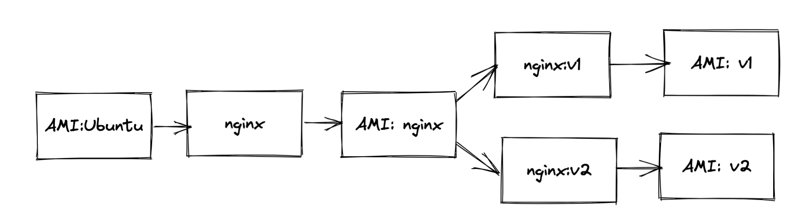
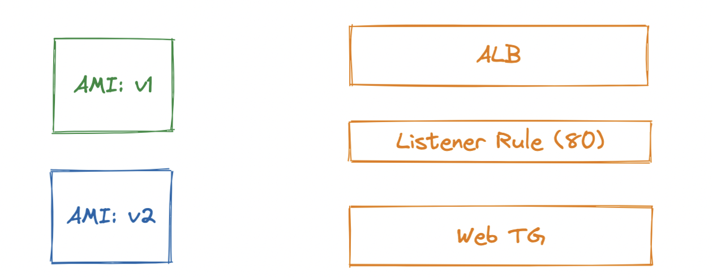
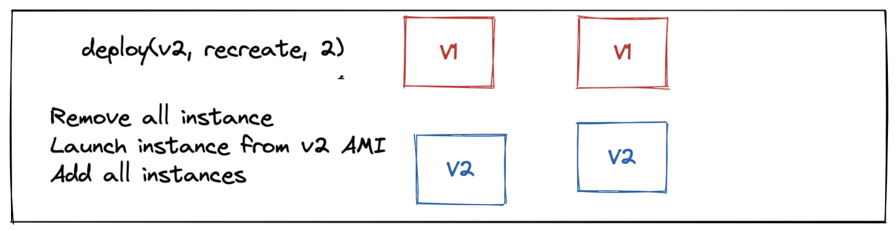
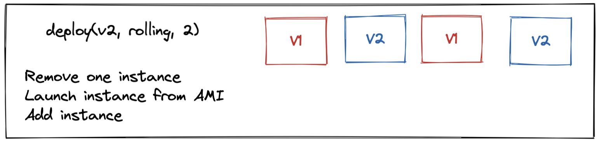

# DeploymentStrategies

This repository is created to get your hands dirty with various deployment strategies in a very simplistic fashion.

Corrently this repository, contains 2 branch
* v1
* v2

To see how to validate v1 & v2 codebase simply execute the Makefile
```
make build
make run
```

## Release 1 Snapshot


## Release 2 Snapshot


Deployment strategies that we would like you to cover are
* Recreate
* Rolling
* Blue/Green
* Canary

To just focus on Deployment strategies, we recommend that you pre-create all these things
* Nginx AMI of v1 codebase (You can use Packer to create AMI)
* Nginx AMI of v2 codebase (You can use Packer to create AMI)
* ALB with with listener rule 80 (You can use AWS CLI to create ALB & listener rule)
* An empty default web tg (You can use AWS CLI to create web-tg)

## AMI


## Initial Setup


## Recreate Deployment Strategy


## Rolling Deployment Strategu

